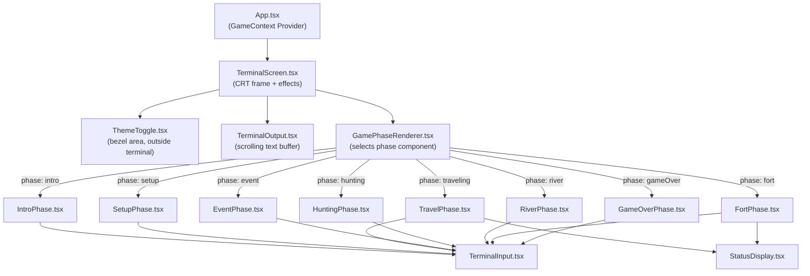

# Technical Architecture — Oregon Trail

## 1. Overview

The Oregon Trail is a fully client-side, single-page React application that recreates the 1971 text-based game in the browser. There is no backend, no database, and no network communication during gameplay. All game logic — state transitions, random event resolution, supply calculations, and turn progression — runs in the browser via a TypeScript game engine exposed to the UI through React's `useReducer` and Context API.

The architecture follows a **state-machine-driven game engine** pattern. The game engine is a pure TypeScript module with no React dependency — it defines the game state shape, all legal actions, and the reducer that transitions between states. React components are thin rendering layers that read the current state and dispatch actions. This separation ensures the game logic is independently testable and the UI is a simple projection of state.

**Key architectural patterns:**

- **Finite state machine** — The game progresses through discrete phases (intro → setup → traveling → event/hunting/river/fort → game over). Each phase defines which actions are valid and what the UI renders.
- **Reducer pattern** — All state transitions go through a single pure reducer function. No side effects in the reducer; randomness is injected as action payloads from the component layer.
- **Static data layer** — Game constants (landmarks, prices, event tables, probabilities) are TypeScript modules imported at build time. No runtime data fetching.
- **Feature-by-layer organization** — The codebase separates the game engine (pure logic), UI components (React), and static data into distinct directories.

**System boundaries:**

- **In-scope:** Game engine, terminal UI, CRT visual effects, theme switching, static game data
- **External:** Google Fonts CDN (VT323 font loaded at page load), GitHub Pages (static hosting)
- **No external services at runtime** — the game is fully self-contained after initial page load

This architecture serves all four features defined in `gspec/features/`: core gameplay mechanics are implemented in the game engine; 1971 gameplay fidelity is enforced by the static data layer and engine rules; the monochrome terminal aesthetic is handled by the component and styling layers; onboarding instructions are a game phase rendered by the UI.

---

## 2. Project Structure

### Directory Layout

```
oregon-trail/
├── src/
│   ├── main.tsx                    # Application entry point — renders <App /> into #root
│   ├── App.tsx                     # Root component — provides GameContext, renders TerminalScreen
│   ├── engine/                     # Pure game engine — no React imports allowed
│   │   ├── state.ts                # GameState type, initial state factory, phase types
│   │   ├── reducer.ts              # Game reducer — all state transitions
│   │   ├── actions.ts              # Action type discriminated union
│   │   ├── events.ts               # Random event resolution logic
│   │   ├── hunting.ts              # Hunting mechanic calculations
│   │   ├── river.ts                # River crossing logic and outcomes
│   │   ├── travel.ts               # Turn progression, distance, and supply consumption
│   │   ├── health.ts               # Party health calculations and illness logic
│   │   └── types.ts                # Shared engine types (Supplies, Landmark, Party, etc.)
│   ├── data/                       # Static game data — constants, no logic
│   │   ├── landmarks.ts            # Trail landmarks with distances and descriptions
│   │   ├── prices.ts               # Supply prices and starting budget
│   │   ├── events.ts               # Event probability tables and templates
│   │   └── text.ts                 # Game text strings (intro, prompts, messages)
│   ├── components/                 # React UI components
│   │   ├── TerminalScreen.tsx      # Terminal frame, CRT effects, scrolling container
│   │   ├── TerminalOutput.tsx      # Renders game text output lines
│   │   ├── TerminalInput.tsx       # Text input with prompt prefix and block cursor
│   │   ├── GamePhaseRenderer.tsx   # Routes current game phase to the correct phase component
│   │   ├── phases/                 # One component per game phase
│   │   │   ├── IntroPhase.tsx      # Onboarding text and "press enter to begin"
│   │   │   ├── SetupPhase.tsx      # Supply purchasing flow
│   │   │   ├── TravelPhase.tsx     # Turn status display and travel options
│   │   │   ├── EventPhase.tsx      # Random event display and resolution
│   │   │   ├── HuntingPhase.tsx    # Speed-typing hunting mechanic
│   │   │   ├── RiverPhase.tsx      # River crossing decision and outcome
│   │   │   ├── FortPhase.tsx       # Fort stop and resupply
│   │   │   └── GameOverPhase.tsx   # Win/loss screen with restart option
│   │   ├── StatusDisplay.tsx       # Formatted status block (health, supplies, distance)
│   │   ├── ThemeToggle.tsx         # Green/amber phosphor theme switcher
│   │   └── ErrorBoundary.tsx       # Terminal-styled error fallback
│   ├── context/                    # React context providers
│   │   └── GameContext.tsx         # GameState + dispatch via useReducer, wrapped in Context
│   ├── hooks/                      # Custom React hooks
│   │   ├── useGameDispatch.ts      # Typed dispatch hook from GameContext
│   │   ├── useGameState.ts         # Typed state selector hook from GameContext
│   │   ├── useTerminalOutput.ts    # Manages the scrolling text output buffer
│   │   ├── useTypewriter.ts        # Character-by-character text rendering
│   │   ├── useTheme.ts             # Theme state (green/amber) with localStorage persistence
│   │   └── useHuntingTimer.ts      # Timing logic for the hunting speed-typing mechanic
│   └── styles/                     # Global styles and design tokens
│       ├── tokens.css              # CSS custom properties from gspec/style.md
│       ├── global.css              # Reset, font loading, root element styles
│       ├── crt-effects.module.css  # Scanline, glow, vignette overlays
│       └── terminal.module.css     # Terminal frame and text area styles
├── tests/                          # All test files — mirrors src/ structure
│   ├── engine/                     # Engine unit and integration tests
│   │   ├── reducer.spec.ts
│   │   ├── events.spec.ts
│   │   ├── hunting.spec.ts
│   │   ├── river.spec.ts
│   │   ├── travel.spec.ts
│   │   └── health.spec.ts
│   ├── components/                 # Component tests with React Testing Library
│   │   ├── TerminalScreen.spec.tsx
│   │   ├── TerminalInput.spec.tsx
│   │   └── phases/
│   │       ├── IntroPhase.spec.tsx
│   │       ├── SetupPhase.spec.tsx
│   │       └── HuntingPhase.spec.tsx
│   ├── data/                       # Data validation tests
│   │   └── landmarks.spec.ts
│   └── fixtures/                   # Predefined game states for testing
│       ├── initial-state.ts
│       ├── mid-journey.ts
│       └── low-supplies.ts
├── e2e/                            # Playwright end-to-end tests
│   ├── full-game.spec.ts           # Complete game flow (seeded RNG)
│   ├── setup.spec.ts               # Supply purchasing flow
│   ├── hunting.spec.ts             # Hunting mechanic interaction
│   └── playwright.config.ts        # Playwright configuration
├── public/                         # Static assets served as-is
│   └── favicon.ico                 # Terminal/CRT-themed favicon
├── gspec/                          # Specification documents (not deployed)
├── .github/
│   └── workflows/
│       └── ci.yml                  # Lint → typecheck → test → build → deploy pipeline
├── index.html                      # Vite entry HTML — includes #root div and font preload
├── vite.config.ts                  # Vite configuration
├── tsconfig.json                   # TypeScript configuration (strict mode)
├── eslint.config.js                # ESLint flat config
├── .prettierrc                     # Prettier configuration
├── package.json                    # Dependencies and scripts
└── .node-version                   # Node.js 20.x LTS
```

### File Naming Conventions

| Category | Convention | Example |
|---|---|---|
| React components | `PascalCase.tsx` | `TerminalScreen.tsx`, `HuntingPhase.tsx` |
| Engine modules | `kebab-case.ts` or `camelCase.ts` | `state.ts`, `events.ts`, `hunting.ts` |
| Hooks | `camelCase.ts` with `use` prefix | `useGameState.ts`, `useTypewriter.ts` |
| Style modules | `kebab-case.module.css` | `crt-effects.module.css` |
| Global styles | `kebab-case.css` | `tokens.css`, `global.css` |
| Test files | `[source-name].spec.ts(x)` | `reducer.spec.ts`, `TerminalInput.spec.tsx` |
| Data files | `kebab-case.ts` or `camelCase.ts` | `landmarks.ts`, `prices.ts` |
| Type files | `types.ts` within module directory | `src/engine/types.ts` |

### Key File Locations

| Purpose | Path |
|---|---|
| Application entry point | `src/main.tsx` |
| Root component | `src/App.tsx` |
| Game state and reducer | `src/engine/state.ts`, `src/engine/reducer.ts` |
| Design tokens (CSS custom properties) | `src/styles/tokens.css` |
| Global styles and font loading | `src/styles/global.css` |
| Static game data (landmarks, prices, events) | `src/data/` |
| CI/CD pipeline | `.github/workflows/ci.yml` |
| Vite config | `vite.config.ts` |
| TypeScript config | `tsconfig.json` |
| HTML entry | `index.html` |

---

## 3. Data Model

This application has no database. All data exists as in-memory TypeScript objects during a game session, managed by `useReducer`. Static reference data (landmarks, prices, event tables) is defined as TypeScript constants in `src/data/` and bundled at build time.

### Entity Relationship Diagram

```mermaid
erDiagram
    GameState ||--|| Supplies : "has"
    GameState ||--|| Party : "has"
    GameState ||--|{ OutputLine : "contains"
    GameState ||--o| CurrentEvent : "may have active"
    GameState }o--|| Landmark : "is at"
    Trail ||--|{ Landmark : "consists of"
    EventTable ||--|{ EventTemplate : "contains"

    GameState {
        GamePhase phase "intro | setup | traveling | event | hunting | river | fort | gameOver"
        number turnNumber "0-based, each turn is ~2 weeks"
        number month "3-12 (March-December 1848)"
        number day "1-31"
        number milesTraveled "cumulative"
        number currentLandmarkIndex "index into landmarks array"
        TravelPace pace "steady | strenuous | grueling"
        RationLevel rations "filling | meager | bareBones"
        Weather weather "warm | cool | cold | rainy | snowy"
        GameOverReason gameOverReason "optional, set when phase is gameOver"
    }

    Supplies {
        number money "remaining dollars"
        number food "pounds of food"
        number ammunition "units"
        number clothing "sets of clothing"
        number oxen "number of oxen in team"
        number miscellaneousSupplies "miscellaneous supplies"
    }

    Party {
        boolean member1Alive "party member 1 (leader)"
        boolean member2Alive "party member 2"
        boolean member3Alive "party member 3"
        boolean member4Alive "party member 4"
        boolean member5Alive "party member 5"
        HealthStatus health "good | fair | poor | veryPoor"
    }

    Landmark {
        string name "e.g. Fort Kearney, Chimney Rock"
        number mileFromStart "distance from Independence MO"
        LandmarkType type "fort | river | landmark"
        string description "brief historical note"
        number riverDepth "optional, for river crossings"
        number ferryPrice "optional, for river crossings"
    }

    CurrentEvent {
        EventType type "illness | weather | equipment | theft | encounter | lostTrail"
        string message "event description text"
        EventSeverity severity "minor | moderate | severe"
        EventChoice[] choices "optional player choices"
    }

    EventTemplate {
        EventType type "category of event"
        number probability "0-1 base probability"
        string messageTemplate "text template"
        EventSeverity severity "minor | moderate | severe"
    }

    OutputLine {
        string text "the text content"
        TextBrightness brightness "bright | medium | dim"
    }

    Trail {
        string startLocation "Independence MO"
        string endLocation "Oregon City OR"
        number totalMiles "approximately 2000"
    }
```



### Entity Details

#### GameState

| Field | Type | Constraints |
|---|---|---|
| phase | `GamePhase` | Required. Discriminated union: `'intro' \| 'setup' \| 'traveling' \| 'event' \| 'hunting' \| 'river' \| 'fort' \| 'gameOver'` |
| turnNumber | number | Required. Starts at 0, increments each travel turn |
| month | number | Required. 3–12 (March through December 1848) |
| day | number | Required. 1–31 |
| milesTraveled | number | Required. Starts at 0, max ~2040 |
| currentLandmarkIndex | number | Required. Index into the landmarks array |
| pace | `TravelPace` | Required. `'steady' \| 'strenuous' \| 'grueling'` |
| rations | `RationLevel` | Required. `'filling' \| 'meager' \| 'bareBones'` |
| weather | `Weather` | Required. Updated each turn based on month and RNG |
| supplies | `Supplies` | Required. Nested object |
| party | `Party` | Required. Nested object |
| currentEvent | `CurrentEvent \| null` | Null when no event is active |
| output | `OutputLine[]` | Required. Terminal text history |
| gameOverReason | `GameOverReason \| null` | Set when phase is `'gameOver'` |

Introduced by: [Core Gameplay Mechanics](../features/core-gameplay.md), [1971 Gameplay Fidelity](../features/gameplay-fidelity.md)

#### Supplies

| Field | Type | Constraints |
|---|---|---|
| money | number | Required. Starts at starting budget (e.g. $700). Can reach 0 |
| food | number | Required. Pounds. Consumed per turn based on ration level |
| ammunition | number | Required. Units. Consumed by hunting |
| clothing | number | Required. Sets. Affects cold weather survival |
| oxen | number | Required. Min 0. Losing all oxen is catastrophic |
| miscellaneousSupplies | number | Required. Miscellaneous supplies (wagon parts, tools, sundries) |

Introduced by: [Core Gameplay Mechanics](../features/core-gameplay.md)

#### Party

| Field | Type | Constraints |
|---|---|---|
| member1Alive | boolean | Required. The wagon leader — if false, game over |
| member2Alive | boolean | Required |
| member3Alive | boolean | Required |
| member4Alive | boolean | Required |
| member5Alive | boolean | Required |
| health | `HealthStatus` | Required. `'good' \| 'fair' \| 'poor' \| 'veryPoor'`. Affects illness probability |

Introduced by: [Core Gameplay Mechanics](../features/core-gameplay.md)

**Note:** The 1971 original tracked party members as a count (5 settlers), not as individually named characters. Party naming was introduced in the 1985 edition and is out of scope. The boolean-per-member approach preserves the count while allowing individual member deaths via random events.

#### Landmark

| Field | Type | Constraints |
|---|---|---|
| name | string | Required. Historical landmark name |
| mileFromStart | number | Required. Cumulative distance from Independence, MO |
| type | `LandmarkType` | Required. `'fort' \| 'river' \| 'landmark'` |
| description | string | Required. Brief contextual text displayed on arrival |
| riverDepth | number \| undefined | Only for `type: 'river'`. Affects crossing difficulty |
| ferryPrice | number \| undefined | Only for `type: 'river'`. Cost to take the ferry |

Introduced by: [Core Gameplay Mechanics](../features/core-gameplay.md), [1971 Gameplay Fidelity](../features/gameplay-fidelity.md)

**Note:** Landmarks are static data defined in `src/data/landmarks.ts`. The implementing agent should research the 1971 original's documented route stops. The approximate route includes: Independence MO → Kansas River → Fort Kearney → Chimney Rock → Fort Laramie → Independence Rock → South Pass → Fort Bridger → Soda Springs → Fort Hall → Snake River → Fort Boise → Blue Mountains → The Dalles → Oregon City.

#### CurrentEvent

| Field | Type | Constraints |
|---|---|---|
| type | `EventType` | Required. `'illness' \| 'weather' \| 'equipment' \| 'theft' \| 'encounter' \| 'lostTrail'` |
| message | string | Required. Uppercase event description text |
| severity | `EventSeverity` | Required. `'minor' \| 'moderate' \| 'severe'` |
| choices | `EventChoice[]` | Optional. Present when the event requires a player decision (e.g. river crossing options) |

Introduced by: [Core Gameplay Mechanics](../features/core-gameplay.md)

#### OutputLine

| Field | Type | Constraints |
|---|---|---|
| text | string | Required. The text content to display |
| brightness | `TextBrightness` | Required. `'bright' \| 'medium' \| 'dim'`. Maps to the three phosphor brightness levels |

Introduced by: [Monochrome Terminal Aesthetic](../features/terminal-aesthetic.md)

### Relationship Notes

- **GameState is a single flat-ish object** — no entity relationships in the traditional database sense. The "entities" above are nested TypeScript types within the GameState interface. The reducer operates on the entire GameState atomically.
- **Landmark data is static** — it lives in `src/data/landmarks.ts` as a readonly array. GameState references landmarks by index (`currentLandmarkIndex`), not by copying landmark data into state.
- **Event templates vs. active events** — `src/data/events.ts` contains EventTemplate objects (probability tables). When an event fires during travel, the engine creates a `CurrentEvent` instance from the matching template and attaches it to GameState. The `CurrentEvent` is ephemeral — it exists only while the event phase is active.
- **Output buffer** — `OutputLine[]` accumulates all terminal text for the current game session. It is append-only during gameplay. This is the data source for the `TerminalOutput` component. The buffer is cleared on new game.

---

## 4. API Design

**Not applicable.** The application runs entirely in the browser with no server-side component. There are no API endpoints, no network requests during gameplay, and no request/response patterns to define.

All "data access" happens through direct TypeScript module imports of static data and through the `useReducer` dispatch/state pattern for game state.

---

## 5. Page & Component Architecture

### Page Map

The application is a single-page app with no routing. All "screens" are game phases rendered by the same component tree based on the `GameState.phase` value. There is one HTML page (`index.html`) and one React mount point.



### Shared Components

| Component | Purpose | Used By |
|---|---|---|
| `TerminalScreen` | CRT frame with bezel border, scanlines, glow, and vignette overlays. Contains the scrolling output area and input. | `App` (root container) |
| `TerminalOutput` | Renders the `OutputLine[]` buffer as styled text lines. Auto-scrolls to bottom on new content. Uses `role="log"` and `aria-live="polite"` for accessibility. | `TerminalScreen` |
| `TerminalInput` | Text input with `> ` prompt prefix, block cursor, VT323 font. Handles Enter key submission. Focus management. | All phase components that accept player input |
| `StatusDisplay` | Formatted status block showing health, supplies, weather, distance. Uses dash separators and monospace-aligned columns. | `TravelPhase`, `FortPhase` |
| `ThemeToggle` | Green/amber theme switcher. Positioned in the bezel area outside the terminal frame. | `TerminalScreen` |
| `ErrorBoundary` | Catches React errors and displays a terminal-styled error message instead of a blank screen. | `App` (wraps game tree) |
| `GamePhaseRenderer` | Switch component that renders the correct phase component based on `GameState.phase`. | `TerminalScreen` |

### Component Patterns

#### Phase Components

Each game phase has a dedicated component in `src/components/phases/`. Phase components:
- Read game state via `useGameState()` hook
- Dispatch actions via `useGameDispatch()` hook
- Append text to the terminal output buffer by dispatching `APPEND_OUTPUT` actions
- Render a `TerminalInput` when player input is needed
- Handle input submission by parsing the player's response and dispatching the appropriate game action

#### Data Flow

```
Player types → TerminalInput → Phase Component → dispatch(action) → reducer → new GameState → re-render
```

1. `TerminalInput` captures text and calls an `onSubmit` callback provided by the active phase component
2. The phase component interprets the input (e.g., parses a number for a menu choice, validates a dollar amount)
3. The phase component dispatches a typed action to the game reducer
4. The reducer produces the next GameState (potentially changing the phase)
5. React re-renders the component tree with the new state
6. `GamePhaseRenderer` renders the component matching the new phase

#### Terminal Output Management

The `useTerminalOutput` hook manages the scrolling text buffer:
- Phase components dispatch `APPEND_OUTPUT` actions with text and brightness level
- The reducer appends to the `output: OutputLine[]` array in state
- `TerminalOutput` renders the full buffer and auto-scrolls to the latest content
- The optional typewriter effect (via `useTypewriter` hook) renders new text character-by-character before committing it to the output buffer

#### Form Handling

There are no forms in the traditional sense. All player input goes through `TerminalInput`:
- Player types a response and presses Enter
- The phase component receives the raw string
- Validation is inline: if the input is invalid (e.g., non-numeric when a number is expected), the phase appends an error message to the output and re-prompts
- No validation library needed — inputs are simple (numbers, short words)

#### Error Boundary

`ErrorBoundary` wraps the game component tree. On error, it renders a terminal-styled message (e.g., `*** SYSTEM ERROR ***`) with a "restart" option that resets the game state. Styled consistently with the CRT aesthetic.

---

## 6. Service & Integration Architecture

### Internal Services

There is no traditional service layer. Game logic is organized as pure functions in `src/engine/`:

| Module | Responsibility |
|---|---|
| `reducer.ts` | Central state transition function. Handles all action types. Delegates to specialized modules for complex logic. |
| `travel.ts` | Calculates distance per turn based on pace, oxen count, and weather. Advances the date. Determines if a landmark is reached. |
| `events.ts` | Rolls for random events based on probability tables. Resolves event outcomes (supply loss, health impact, party member death). |
| `hunting.ts` | Calculates food acquired based on typing speed. Deducts ammunition. |
| `river.ts` | Resolves river crossing outcomes based on the chosen method and river conditions. |
| `health.ts` | Updates party health based on rations, weather, clothing, and random illness. Determines party member deaths. |

**Pattern:** The reducer calls these modules as pure functions, passing the relevant slice of state and any randomness inputs. They return the state changes, and the reducer merges them into the next GameState.

**Randomness injection:** The reducer does NOT call `Math.random()` directly. Instead, random values are generated in the component layer (or in a hook) and passed to the reducer as part of the action payload. This makes the engine fully deterministic and testable — tests supply fixed random seeds.

### External Integrations

| Service | Usage | Integration Point |
|---|---|---|
| Google Fonts CDN | VT323 monospace font | `<link>` tag in `index.html` with `font-display: swap` and preconnect hint |
| GitHub Pages | Static hosting | GitHub Actions deploys the Vite `dist/` output |

No API clients, webhooks, or runtime external service calls.

### Background Jobs / Events

Not applicable. There are no async operations, background jobs, or event queues. The game is synchronous and turn-based — every state transition is the immediate result of a player action.

---

## 7. Authentication & Authorization Architecture

**Not applicable.** The application has no user accounts, no authentication, and no authorization. It is a static, anonymous, single-player game. All players are equal — there are no roles, permissions, or protected resources.

---

## 8. Environment & Configuration

### Environment Variables

The application requires no environment variables for runtime. Vite's build-time variables are the only configuration surface:

```env
# Vite built-in (no .env file needed for development)
# VITE_BASE_URL is set automatically by Vite based on the `base` config

# GitHub Actions (set automatically, not user-configured)
# GITHUB_TOKEN — used by actions/deploy-pages for GitHub Pages deployment
```

No `.env` file is needed for local development. The game has no secrets, no API keys, and no external service credentials.

### Configuration Files

| File | Purpose | Notes |
|---|---|---|
| `vite.config.ts` | Vite bundler config | Set `base` to the repo name for GitHub Pages (e.g., `base: '/oregon-trail/'`). Configure React plugin. |
| `tsconfig.json` | TypeScript config | `strict: true`, target `ES2020`, JSX `react-jsx`. Path aliases optional. |
| `eslint.config.js` | ESLint flat config | `@typescript-eslint`, `react-hooks`, `react-refresh` plugins. |
| `.prettierrc` | Prettier config | Single quotes, no semicolons (or team preference). |
| `playwright.config.ts` | Playwright E2E config | Base URL `http://localhost:5173`. Headless by default. |
| `.node-version` | Node.js version | `20` (LTS) |
| `.github/workflows/ci.yml` | CI/CD pipeline | Lint → typecheck → test → build → deploy stages |

#### Vite Configuration Snippet

```typescript
import { defineConfig } from 'vite'
import react from '@vitejs/plugin-react'

export default defineConfig({
  plugins: [react()],
  base: '/oregon-trail/',
  build: {
    outDir: 'dist',
    sourcemap: false,
  },
})
```

#### TypeScript Configuration Snippet

```json
{
  "compilerOptions": {
    "target": "ES2020",
    "lib": ["ES2020", "DOM", "DOM.Iterable"],
    "module": "ESNext",
    "moduleResolution": "bundler",
    "strict": true,
    "jsx": "react-jsx",
    "outDir": "dist",
    "skipLibCheck": true,
    "noUnusedLocals": true,
    "noUnusedParameters": true,
    "noFallthroughCasesInSwitch": true
  },
  "include": ["src"]
}
```

### Project Setup

```bash
# 1. Clone and install
git clone <repo-url>
cd oregon-trail
npm install

# 2. Start development server
npm run dev
# Opens at http://localhost:5173/oregon-trail/

# 3. Run tests
npm test              # Vitest unit/integration tests
npm run test:e2e      # Playwright E2E tests (requires dev server running)

# 4. Lint and typecheck
npm run lint          # ESLint
npm run typecheck     # tsc --noEmit
npm run format        # Prettier

# 5. Production build
npm run build         # Outputs to dist/
npm run preview       # Preview production build locally
```

#### Key Package Categories

| Category | Packages |
|---|---|
| Core | `react`, `react-dom` |
| Build | `vite`, `@vitejs/plugin-react` |
| Type checking | `typescript`, `@types/react`, `@types/react-dom` |
| Linting | `eslint`, `@typescript-eslint/eslint-plugin`, `@typescript-eslint/parser`, `eslint-plugin-react-hooks`, `eslint-plugin-react-refresh` |
| Formatting | `prettier` |
| Unit testing | `vitest`, `@testing-library/react`, `@testing-library/jest-dom`, `jsdom` |
| E2E testing | `@playwright/test` |
| Pre-commit | `husky`, `lint-staged` |

---

## 9. Technical Gap Analysis

### Identified Gaps

#### Gap 1: Hunting Mechanic — Timing Implementation

**What's missing:** The core gameplay and fidelity PRDs specify a "speed-typing challenge" for hunting (type a word like "BANG" as quickly as possible), but do not specify the exact timing thresholds or food-reward formula.

**Why it matters:** The implementing agent needs concrete numbers to translate typing speed into food acquired. Without them, the hunting balance will be arbitrary.

**Proposed solution:**
- Use `performance.now()` in the `useHuntingTimer` hook to measure milliseconds between the prompt appearing and the player submitting the correct word
- Define thresholds in `src/data/events.ts` (these are tunable constants, not hardcoded in logic):
  - < 1 second: excellent result (large food reward)
  - 1–2 seconds: good result
  - 2–4 seconds: fair result
  - > 4 seconds: poor result (minimal food)
  - Incorrect word: miss (no food, ammunition still consumed)
- The original likely used similar coarse brackets given Teletype input lag. Cross-reference the 1975 BASIC source for the formula if available.

**Resolution:** Deferred to implementation — the implementing agent should research the original's formula and calibrate these values during playtesting.

#### Gap 2: Random Event Probability Tables

**What's missing:** The feature PRDs reference "the original game's probability tables" but do not include the actual values. The open questions in `core-gameplay.md` explicitly call this out.

**Why it matters:** Event probabilities define game difficulty and pacing. Incorrect values make the game too easy or too punishing.

**Proposed solution:**
- Define probability tables in `src/data/events.ts` as a typed array of `EventTemplate` objects
- Base probabilities on the published 1975 BASIC source listing (the closest documented source to the 1971 original)
- Structure probabilities to be modifiable: each event has a `baseProbability` (0–1) and optional modifiers based on game state (e.g., low food increases illness probability)
- Flag any invented probabilities with a comment noting they are approximations

**Resolution:** Deferred to implementation research. The implementing agent should consult the published BASIC source code.

#### Gap 3: Supply Prices and Starting Budget

**What's missing:** The PRDs reference "the 1971 original's values" for item prices and starting budget but do not specify them.

**Why it matters:** These numbers define the economic model of the game. The starting budget constrains all purchasing decisions.

**Proposed solution:**
- Define prices and budget in `src/data/prices.ts` as named constants
- Research the published source listings for exact values
- If exact values are unavailable, document the approximation and calibrate through playtesting

**Resolution:** Deferred to implementation research.

#### Gap 4: Typewriter Effect and Input Blocking

**What's missing:** The style guide describes an optional typewriter effect (30–50ms per character) that is "skippable via keypress." The interaction between the typewriter animation and the terminal input is not defined. Can the player type while text is still printing? Does pressing a key skip to the end of the current text block only, or all pending text?

**Why it matters:** If not handled, the typewriter effect could block player input and create a frustrating experience, especially for repeat players.

**Proposed solution:**
- While typewriter text is animating, the `TerminalInput` is hidden (no prompt visible)
- Any keypress during animation immediately completes the current text block (jumps to fully rendered)
- After the text finishes (naturally or via skip), the input prompt appears
- The `useTypewriter` hook manages this state: `isAnimating: boolean`
- Respect `prefers-reduced-motion`: if set, disable typewriter entirely (text appears instantly)

**Resolution:** Proposed. Implement as described above.

#### Gap 5: Terminal Output Buffer Size

**What's missing:** The `OutputLine[]` array grows throughout a game session. No limit or cleanup strategy is defined.

**Why it matters:** A full game generates hundreds of text lines. In a browser, this is a trivial amount of memory (< 1 MB), but the DOM could accumulate many elements.

**Proposed solution:**
- Do not cap the buffer. A full game session generates at most a few hundred lines — well within browser DOM capacity
- `TerminalOutput` renders all lines and uses `overflow-y: auto` with auto-scroll to bottom
- If performance becomes an issue (unlikely), implement windowed rendering using a simple manual approach (render only the last N lines plus a scroll viewport), but do not add this preemptively

**Resolution:** No action needed. Monitor during implementation.

#### Gap 6: Theme Toggle Accessibility and Persistence

**What's missing:** The terminal aesthetic PRD says "a small, unobtrusive toggle" for theme switching, with persistence in `localStorage`. The style guide says it should be "outside the terminal frame (e.g., in the bezel area)." The exact interaction pattern (keyboard shortcut? button? toggle switch?) is not defined.

**Why it matters:** The toggle must be accessible (keyboard reachable, screen reader friendly) while remaining visually unobtrusive.

**Proposed solution:**
- Render the toggle as a text-only button in the bezel area below or beside the terminal frame
- Label: `[GREEN]` / `[AMBER]` (shows the alternative, not the current theme)
- Keyboard accessible via Tab focus
- `aria-label="Switch to amber phosphor theme"` / `"Switch to green phosphor theme"`
- Persist to `localStorage` key `'oregon-trail-theme'` via the `useTheme` hook
- On page load, read from `localStorage` and apply before first paint (set the CSS class on `<html>` in the `index.html` script to avoid flash)

**Resolution:** Proposed. Implement as described.

#### Gap 7: Game Phase Transitions and the Reducer's Role

**What's missing:** The stack spec says "do not use `useEffect` for game logic" and that all screens are "state-driven renders." The exact mechanism for multi-step phase transitions (e.g., travel → check for event → if event, show event → resolve → check for landmark → if landmark, show fort) is not specified.

**Why it matters:** A single player action (e.g., "continue traveling") may trigger a chain of state changes (advance distance → roll for event → determine if a landmark is reached). If each step is a separate dispatch, intermediate states will render briefly, causing visual flicker or requiring coordination.

**Proposed solution:**
- **Batch transitions in the reducer.** When a `TRAVEL` action is dispatched, the reducer computes the full turn result in one pass:
  1. Advance distance and date
  2. Consume food based on rations
  3. Roll for random events (random seed passed in the action payload)
  4. Update health
  5. Check for landmark arrival
  6. Set the next phase based on what happened (e.g., `'event'` if an event fired, `'river'` if a river was reached, `'traveling'` if nothing special happened)
- This produces a single state update and a single re-render
- The component layer is responsible for generating the random seed and including it in the action payload

**Resolution:** Proposed. This is the recommended approach — it keeps the reducer pure and avoids multi-step dispatch chains.

### Assumptions

| # | Assumption | Basis |
|---|---|---|
| 1 | The 1971 game had approximately 12 two-week turns covering ~2,000 miles | Gameplay fidelity PRD states "approximately 12 two-week turns" |
| 2 | Party members are tracked as a count (5 settlers) without individual names | The 1971 original did not include party naming; that was added in the 1985 edition |
| 3 | The starting month is March 1848 and the deadline is roughly October/November | Inferred from historical Oregon Trail departure windows and the profile's description |
| 4 | The hunting word is "BANG" (or similar short word) based on the 1975 BASIC source | Referenced in both the PRD and the competitive research |
| 5 | Supply categories are: food (lbs), ammunition (units), clothing (sets), oxen (count), miscellaneous supplies (misc), money ($) | Derived from the core gameplay PRD's supply list |
| 6 | `Math.random()` is adequate for the game's randomness needs | No cryptographic or seeded RNG requirement. Tests mock `Math.random` for determinism |
| 7 | The VT323 Google Font will load quickly enough to avoid a visible FOUT | Mitigated by `font-display: swap` and preconnect hint. Fallback fonts are period-appropriate monospace |
| 8 | The game's total bundle size (React + app code + styles) will fit within the 150 KB gzipped target | React 19 is ~40 KB gzipped. The game logic and data are small. CSS is minimal. This should fit comfortably |

---

## 10. Open Decisions

| # | Decision | Context | When to Resolve |
|---|---|---|---|
| 1 | Exact probability tables for random events | Requires research into the published 1975 BASIC source. The architecture supports any set of values in `src/data/events.ts` | Before implementing `src/engine/events.ts` |
| 2 | Exact supply prices and starting budget | Requires the same historical research | Before implementing `src/data/prices.ts` |
| 3 | Hunting timing thresholds and food reward formula | May be derivable from the BASIC source, or may need to be calibrated through playtesting | During implementation of `src/engine/hunting.ts` |
| 4 | Complete landmark list with accurate mileages | Requires verification against historical sources and the original game's route | Before implementing `src/data/landmarks.ts` |
| 5 | Whether to use `structuredClone` or spread syntax for deep state updates in the reducer | Spread is simpler for the current state depth (2 levels). `structuredClone` is safer for deeply nested state but has a small performance cost | During implementation — start with spread, switch if state shape deepens |
| 6 | Typewriter effect default state (on or off) | The style guide says "optional" and the PRD says P1. If on by default, it slows repeat plays. If off by default, first-time players miss the effect | Before implementing `useTypewriter` — recommend **on by default** with keypress-to-skip, respecting `prefers-reduced-motion` |
| 7 | GitHub Pages base path | Depends on the final repository name. Set `base` in `vite.config.ts` accordingly | When the repository is created |
| 8 | SEO metadata approach | The practices guide requires SEO metadata, but this is an SPA with one page. A single `<title>`, `<meta description>`, and Open Graph tags in `index.html` should suffice | During initial scaffold — add static meta tags to `index.html` |
